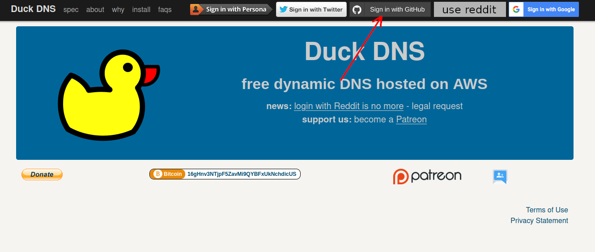
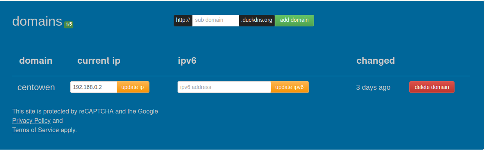
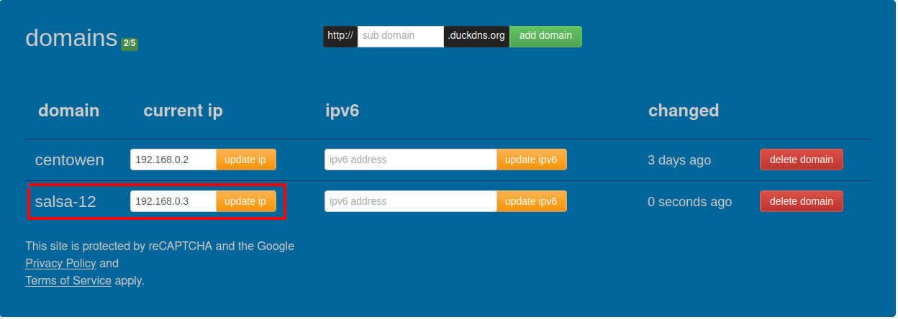

# Running a debug session

## Prerequisites

To build the backend the following dependencies are needed:
* `boost`
* `libuhd`

## Running
Start the backend

```shell
./development/run-backend.sh
```
or
```shell
cargo run --bin backend
```

## Running with https
If you want to work with authentication you should enable https. Otherwise password will not be encrypted in transit and redirect will not work properly (identity server will typically only allow redirect to https address). To run salsa with https a little more work is needed. It will also not be possible to use trunk.

The guide below is based on https://www.splitbrain.org/blog/2017-08/10-homeassistant_duckdns_letsencrypt

1. Set up dns name for salsa-12 (we will issue cert to this DNS)

    1. Go to duckdns.org and login (I use my github account)
        
    2. Create a new domain and set the ip to the machine you plan to serve salsa-12 from. If you are developing it is probably a good idea to use an internal IP here that you can reach, e.g., use 192.168.0.... In this guide the domain will be salsa-12, replace with the name you selected. E.g. you can map salsa-12.duckdns.org -> 192.168.0.2
        
        

2. Download dehydrated

    ```bash
    git clone git@github.com:dehydrated-io/dehydrated.git
    cd dehydrated
    ```

3. Configure dehydrated. 
    1. Set domain to the one created above.

        ```bash
        echo salsa-12.duckdns.org > domains.txt
        ```

    2. A script called `hook.sh` with the following content.

        ```bash
        #!/usr/bin/env bash
        set -e
        set -u
        set -o pipefail

        domain="salsa-12"
        token="you-duckdns-token"

        case "$1" in
            "deploy_challenge")
                curl "https://www.duckdns.org/update?domains=$domain&token=$token&txt=$4"
                echo
                ;;
            "clean_challenge")
                curl "https://www.duckdns.org/update?domains=$domain&token=$token&txt=removed&clear=true"
                echo
                ;;
            "deploy_cert")
                echo "Update certificate"
                echo
                ;;
            "unchanged_cert")
                ;;
            "startup_hook")
                ;;
            "exit_hook")
                ;;
            *)
                echo Unknown hook "${1}"
                exit 0
                ;;
        esac
        ```
    3. Add a file called config with the challengetype and path to the hook script

        ```bash
        CHALLENGETYPE="dns-01"
        HOOK="${BASEDIR}/hook.sh"
        ```

    4. Register with let's encrypt

        ```bash
        ./dehydrated --register  --accept-terms
        ```

    5. See a copy pastable bash command see below. You need to set `DOMAIN` and `TOKEN` first.

        ```bash
        echo $DOMAIN.duckdns.org > domains.txt
        cat >config <<EOL
        CHALLENGETYPE="dns-01"
        HOOK="\${BASEDIR}/hook.sh"
        EOL
        cat >hook.sh <<EOL
        #!/usr/bin/env bash
        set -e
        set -u
        set -o pipefail

        domain="$DOMAIN"
        token="$TOKEN"

        case "\$1" in
            "deploy_challenge")
                curl "https://www.duckdns.org/update?domains=\$domain&token=\$token&txt=\$4"
                echo
                ;;
            "clean_challenge")
                curl "https://www.duckdns.org/update?domains=\$domain&token=\$token&txt=removed&clear=true"
                echo
                ;;
            "deploy_cert")
                echo "Update certificate"
                echo
                ;;
            "unchanged_cert")
                ;;
            "startup_hook")
                ;;
            "exit_hook")
                ;;
            *)
                echo Unknown hook "\${1}"
                exit 0
                ;;
        esac
        EOL
        ./dehydrated --register  --accept-terms
        ```

4. Generate the certificate. This command can be added to cron as well if you want it to be automatically be refreshed.

    ```
    ./dehydrated -c
    ```

5. Add or update `development/env.sh` with path to the certificate and private key from dehydrated. Change salsa-12 to the name you opted for.

    ```bash
    echo "export KEY_FILE_PATH=<path to dehydrated>/certs/salsa.duckdns.org/privkey.pem" >> ./development/env.sh
    echo "export CERT_FILE_PATH=<path to dehydrated>/certs/salsa.duckdns.org/fullchain.pem" >> ./development/env.sh
    ```

6. Run backend with frontend script

    ```bash
    ./development/run-backend-with-frontend.sh
    ```

    Should log that frontend is served and the certificate/key used for https.
